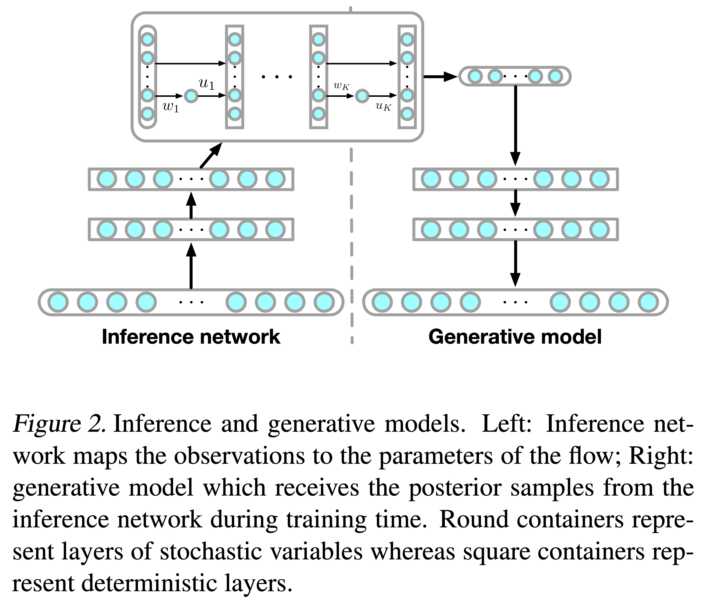
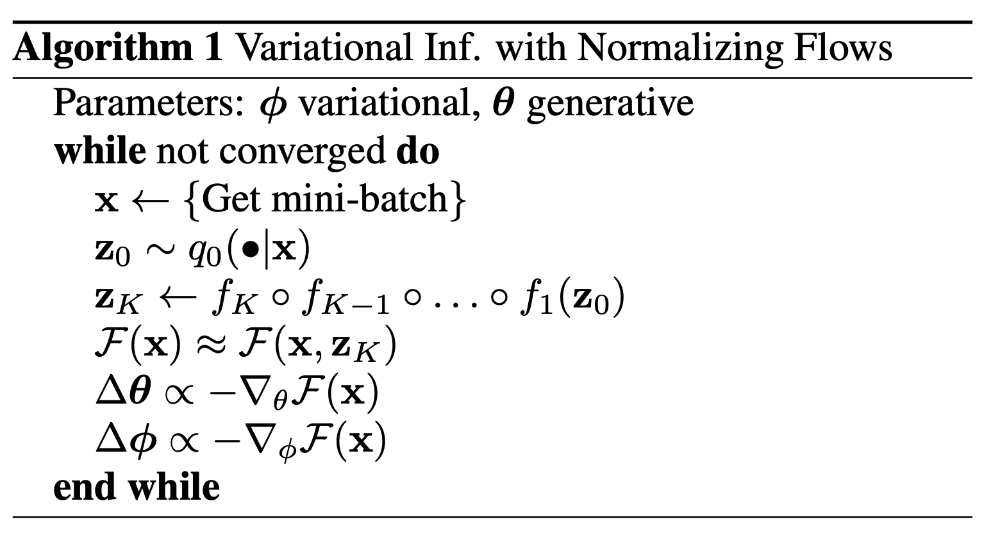

[TensorFlow 2] Variational Inference with Normalizing Flows
=====
TensorFlow implementation of "Variational Inference with Normalizing Flows" [1]

## Concept

    
  
Concept of the Normalizing Flow (NF).

    
  
Algorithm for training NF.

## Results

  
  
<strong>Upper</strong>: target image; <strong>Lower</strong>: restored image.

    
  
<strong>Left</strong>: first density z_0; <strong>Right</strong>: last density z_k.

## Requirements
* Python 3.7.6  
* Tensorflow 2.3.0  
* Numpy 1.18.15
* whiteboxlayer 0.1.17

## Reference
[1] Danilo Jimenez Rezende and Shakir Mohamed. (2015). <a href="https://arxiv.org/abs/1505.05770">Variational Inference with Normalizing Flows</a>. arXiv preprint arXiv:1505.05770.
